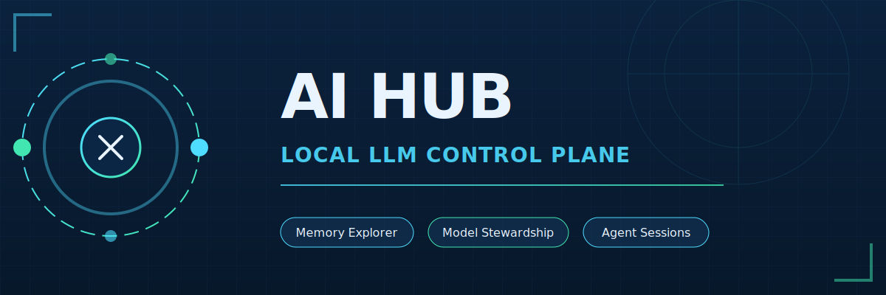

<p align="center">
  
</p>

<p align="center">
  <strong>AI Hub</strong><br/>
  A self-hosted operator workspace for local LLM routing, memory operations, model stewardship, and persistent agent sessions.
</p>

## Why AI Hub Exists

AI Hub is the control surface for a broader local AI ecosystem:

- `AI Hub` handles operator workflows, model inventory, import/pull flows, terminal/code adjacency, and session orchestration.
- `AIKB` is the durable memory and runbook system behind the scenes.
- `LapTime` provides model fit, hardware, and performance context for practical deployment choices.

Together they form a home-lab-native stack for running local models and agent workflows with real operational context instead of isolated demos.

## Product Surfaces

### Explore Memory

Search memory, inspect graph relationships, review provenance, and keep nearby evidence visible while navigating AIKB-backed results.


### Review Proposals

Harvest runtime memory proposals, review queue recommendations, and apply durable knowledge into AIKB with a cleaner operator workflow.


### Model Stewardship

Manage the model fleet on real hardware, inspect Hugging Face repos, choose GGUF quants, stage cleanup safely, and pull models directly into the selected platform.


## Core Capabilities

- **Memory-First Operator Console:** Graph exploration, provenance, and review/apply flows.
- **Model Stewardship:** Hugging Face search, repo inspection, quant-aware import prep, and Ollama pull workflows.
- **Fleet Management:** Per-platform model inventory with notes, stages, cleanup cues, and loaded-state visibility.
- **Operator Ergonomics:** Embedded terminal and code adjacency for fast operational edits.
- **Persistent Sessions:** Session inventory and tmux-backed orchestration through the sessions service.

## Repository Layout

```text
ai-hub/
├── apps/
│   ├── operator-console/  <-- Primary Surface
│   │   ├── public/
│   │   ├── package.json
│   │   └── server.js
│   ├── sessions/          <-- Session Service
│   │   ├── app/
│   │   ├── ui/
│   │   ├── requirements.txt
│   │   └── sync_agent.py
│   └── chat-wrapper/      <-- Legacy
├── assets/
│   ├── hero-graphic.svg
│   ├── ai-hub-logo.svg
│   └── screenshots/
└── infra/
    └── systemd/
```

## Architecture Snapshot

```text
Browser
  -> AI Hub Operator Console (:3001)
    -> Memory Core search + proposal APIs
    -> AIKB preview/apply flows
    -> Hugging Face search + model fit estimation
    -> Ollama platform inventory / pull / cleanup workflows
    -> ttyd terminal proxy
    -> code-server adjacency

Browser
  -> AI Hub Sessions (:8090)
    -> FastAPI + tmux-backed session orchestration
```

## Deployment Status

- `apps/operator-console` is the primary AI Hub surface and active operator entrypoint.
- `apps/sessions` is the repo-backed session service for persistent workflows.
- `apps/chat-wrapper` remains in-tree as a legacy fallback path, not the main product surface.
- Operational deployment details live in AIKB and the companion Ansible repo.

## Near-Term Direction

- Bring platform/device configuration into a first-class settings surface
- Continue improving model grouping, visual hierarchy, and operator ergonomics
- Add stronger CI checks for JavaScript and Python services
- Capture more product documentation and architecture notes directly in this repo

## License

Private internal project. Add explicit license terms if the distribution scope changes.
