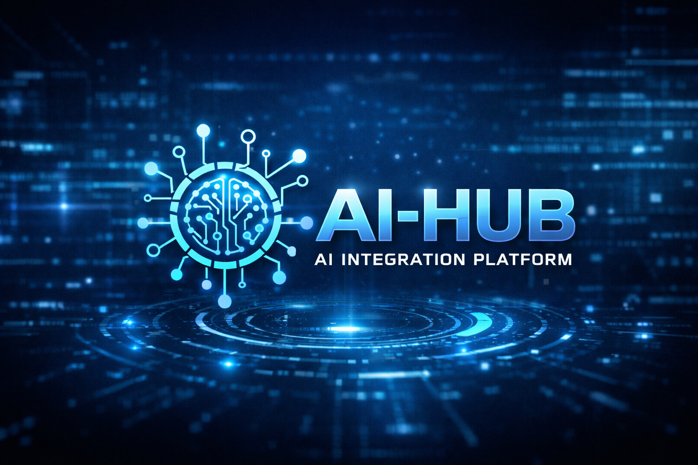
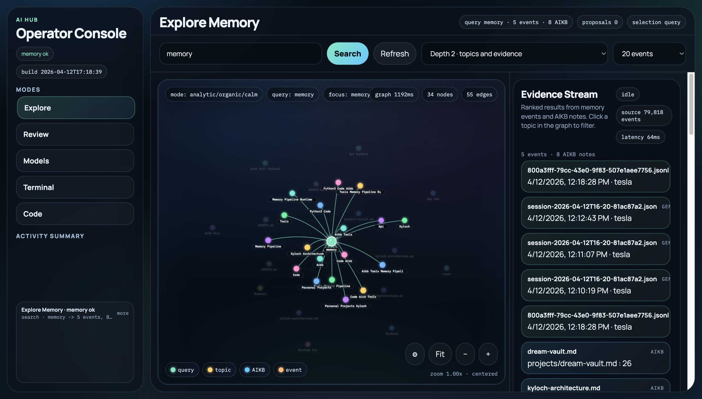
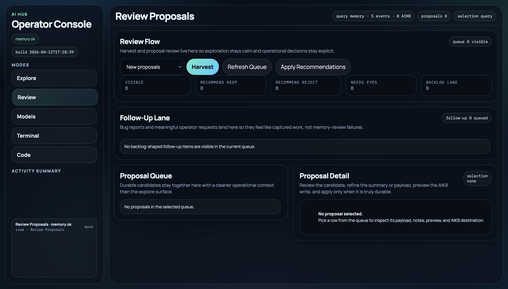
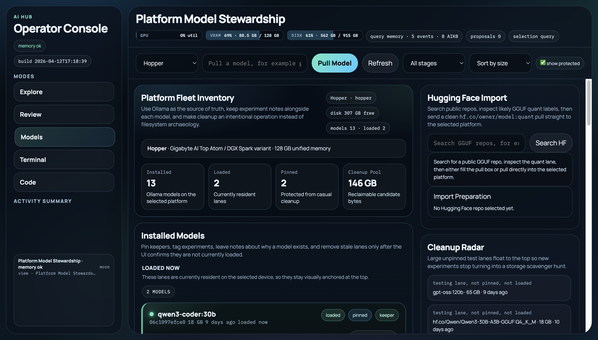

<p align="center">
  
</p>

<p align="center">
  <strong>AI Hub</strong><br/>
  A self-hosted operator workspace for local LLM routing, memory operations, model stewardship, and persistent agent sessions.
</p>

## Why AI Hub Exists

AI Hub is the control surface for a broader local AI ecosystem:

- `AI Hub` handles operator workflows, model inventory, import/pull flows, terminal/code adjacency, and session orchestration.
- `AIKB` is the durable memory and runbook system behind the scenes.
- `LapTime` provides model fit, hardware, and performance context for practical deployment choices.

Together they form a home-lab-native stack for running local models and agent workflows with real operational context instead of isolated demos.

## Product Surfaces

### Explore Memory

Search Memory Core, inspect AIKB-backed relationships, and work from a map-first interface where the graph stays in view while the evidence stream remains ranked and filterable.



### Review Proposals

Harvest runtime memory proposals, review recommendation cues, preview canonical updates, and apply durable knowledge into AIKB without leaving the console.



### Model Stewardship

Manage the model fleet on real hardware, inspect Hugging Face repos, choose GGUF quants, compare platform fit, stage cleanup safely, and pull/load models directly into the selected target.



### Terminal + Code Adjacency

Keep the embedded terminal proxy and code-server close to the operator console so search, review, and live repo edits can happen in one workspace.

### Sessions Service

Run persistent, tmux-backed Claude, Gemini, and Codex sessions through the companion FastAPI service for host-level continuity across devices.

## Core Capabilities

- **Map-Primary Memory Exploration:** Viewport-locked graph canvas, floating controls, topic-node filtering, evidence scoring, path tracing, file filters, and saved scenes in one surface.
- **Proposal Review Workflow:** Harvest, triage, preview, approve, reject, save, and apply proposal candidates into AIKB from the same operator console.
- **Model Stewardship:** Hugging Face search, repo inspection, quant-aware import prep, multi-platform fit context, and Ollama pull/load workflows.
- **Fleet Management:** Per-platform model inventory with notes, stages, cleanup cues, loaded-state visibility, and manual load/unload orchestration.
- **Live Platform Metrics:** Monochromatic topbar meters for GPU utilization, VRAM usage, and disk space with platform-specific context.
- **Operator Ergonomics:** Embedded terminal proxy and code-server adjacency for fast operational edits.
- **Persistent Sessions:** Session inventory and tmux-backed orchestration through the sessions service.

## Repository Layout

```text
ai-hub/
├── apps/
│   ├── operator-console/  <-- Primary Surface
│   │   ├── public/
│   │   ├── package.json
│   │   └── server.js
│   ├── sessions/          <-- Session Service
│       ├── app/
│       ├── ui/
│       ├── requirements.txt
│       └── sync_agent.py
├── assets/
│   ├── hero-graphic.png
│   └── screenshots/
└── infra/
    └── systemd/
```

## Architecture Snapshot

```text
Browser
  -> AI Hub Operator Console (:3001)
    -> Memory Core search + proposal APIs
    -> AIKB preview/apply flows
    -> ranked evidence stream + topic graph filters
    -> Hugging Face search + quant inspection + model fit estimation
    -> per-platform Ollama inventory / pull / load / cleanup workflows
    -> live GPU / VRAM / Disk metrics
    -> ttyd terminal proxy
    -> code-server adjacency

Browser
  -> AI Hub Sessions (:8090)
    -> FastAPI + tmux-backed provider session orchestration
```

## Deployment Status

- `apps/operator-console` is the primary AI Hub surface and active operator entrypoint.
- `apps/operator-console` currently includes Explore Memory, Review Proposals, Model Stewardship, Terminal, and Code surfaces.
- `apps/sessions` is the repo-backed session service for persistent Claude/Gemini/Codex workflows.
- `apps/chat-wrapper` remains in-tree as a legacy fallback path, not the main product surface.
- Operational deployment details live in AIKB and the companion Ansible repo.

## Near-Term Direction

- Bring platform/device configuration into a first-class settings surface
- Continue improving the memory explorer's visual hierarchy, evidence controls, and operator ergonomics
- Add stronger CI checks for JavaScript and Python services
- Capture more product documentation and architecture notes directly in this repo

## License

Private internal project. Add explicit license terms if the distribution scope changes.
 
